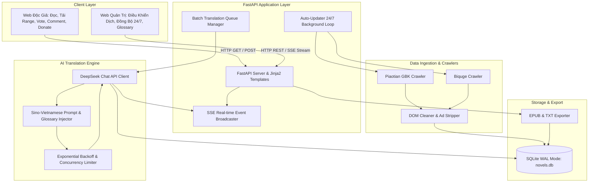

# 🏛️ KIẾN TRÚC HỆ THỐNG "TRUYỆN DỊCH VIỆT" (System Architecture)

Tài liệu này mô tả chi tiết kiến trúc tổng thể, thiết kế cơ sở dữ liệu, luồng xử lý dữ liệu và các module cốt lõi của nền tảng **Truyện Dịch Việt**.

---

## 1. Sơ Đồ Kiến Trúc Tổng Thể (System Architecture Diagram)



---

## 2. Thiết Kế Cơ Sở Dữ Liệu (Database Schema)

Cơ sở dữ liệu sử dụng **SQLite với chế độ Write-Ahead Logging (WAL)** để hỗ trợ đọc/ghi đồng thời với hiệu năng cực cao mà không bị khóa database (lock).

### 2.1 Bảng `novels` (Danh mục bộ truyện)
| Cột | Kiểu Dữ Liệu | Khóa | Mô Tả |
| :--- | :--- | :--- | :--- |
| `id` | `INTEGER` | PK, Auto | ID định danh bộ truyện |
| `title` | `VARCHAR(255)` | Index | Tên gốc tiếng Trung (VD: 仙工开物) |
| `title_vi` | `VARCHAR(255)` | | Tên Việt hóa (VD: Tiên Công Khai Vật) |
| `author` | `VARCHAR(255)` | | Tác giả (VD: 蛊真人 / Cổ Chân Nhân) |
| `description` | `TEXT` | | Tóm tắt giới thiệu tác phẩm |
| `cover_url` | `VARCHAR(500)` | | Đường dẫn ảnh bìa |
| `source_url` | `VARCHAR(500)` | | Link mục lục nguồn nguyên tác |
| `source_name` | `VARCHAR(100)` | | Tên nguồn (piaotia, biquge) |
| `total_chapters`| `INTEGER` | | Tổng số chương đã nạp |
| `translated_chapters` | `INTEGER` | | Số chương đã dịch hoàn tất |
| `favorite_count` | `INTEGER` | | Số lượt độc giả thêm vào Tủ Truyện |
| `request_count` | `INTEGER` | Index | Số lượt độc giả bấm Yêu Cầu Dịch Tiếp |
| `created_at` | `DATETIME` | | Thời điểm tạo |
| `updated_at` | `DATETIME` | Index | Thời điểm cập nhật chương mới nhất |

### 2.2 Bảng `chapters` (Nội dung từng chương)
| Cột | Kiểu Dữ Liệu | Khóa | Mô Tả |
| :--- | :--- | :--- | :--- |
| `id` | `INTEGER` | PK, Auto | ID định danh chương |
| `novel_id` | `INTEGER` | FK -> novels.id | Thuộc bộ truyện nào (CASCADE DELETE) |
| `chapter_index` | `INTEGER` | Index | Thứ tự chương (1, 2, 3...) |
| `chapter_title_raw` | `VARCHAR(255)`| | Tiêu đề gốc tiếng Trung |
| `chapter_title_vi` | `VARCHAR(255)` | | Tiêu đề dịch tiếng Việt |
| `url` | `VARCHAR(500)` | | Link gốc của chương |
| `content_raw` | `TEXT` | | Nội dung văn bản tiếng Trung |
| `content_vi` | `TEXT` | | Nội dung dịch tiếng Việt của DeepSeek |
| `status` | `VARCHAR(50)` | Index | Trạng thái (`pending`, `translating`, `completed`, `error`) |
| `error_msg` | `TEXT` | | Thông báo lỗi nếu dịch thất bại |
| `translated_at`| `DATETIME` | | Thời điểm dịch hoàn tất |
| `created_at` | `DATETIME` | | Thời điểm nạp chương |

*Index kết hợp:* `CREATE INDEX ix_novel_chapter_index ON chapters(novel_id, chapter_index);`

### 2.3 Bảng `glossaries` (Từ điển danh xưng & thuật ngữ)
| Cột | Kiểu Dữ Liệu | Khóa | Mô Tả |
| :--- | :--- | :--- | :--- |
| `id` | `INTEGER` | PK, Auto | ID định danh từ |
| `novel_id` | `INTEGER` | FK (nullable) | Áp dụng riêng cho truyện (hoặc `NULL` cho toàn hệ thống) |
| `original_term` | `VARCHAR(255)` | Index | Thuật ngữ gốc tiếng Trung (VD: `宁拙`) |
| `translated_term`| `VARCHAR(255)` | | Nghĩa dịch chuẩn tiếng Việt (VD: `Ninh Chuyết`) |
| `note` | `VARCHAR(255)` | | Ghi chú (VD: Tên nhân vật chính) |

### 2.4 Bảng `comments` (Bình luận độc giả)
| Cột | Kiểu Dữ Liệu | Khóa | Mô Tả |
| :--- | :--- | :--- | :--- |
| `id` | `INTEGER` | PK, Auto | ID bình luận |
| `novel_id` | `INTEGER` | FK -> novels.id | Thuộc bộ truyện nào |
| `chapter_index` | `INTEGER` | Index (nullable)| Bình luận cho chương cụ thể (hoặc `NULL` cho toàn truyện) |
| `user_name` | `VARCHAR(100)` | | Danh xưng người bình luận |
| `user_avatar` | `VARCHAR(50)` | | Biểu tượng đạo hiệu (🧙‍♂️, ⚔️, 🐉...) |
| `content` | `TEXT` | | Nội dung bình luận |
| `likes` | `INTEGER` | | Số lượt thả tim |
| `created_at` | `DATETIME` | Index | Thời gian bình luận |

---

## 3. Các Module Cốt Lõi (Core Modules)

### 3.1 Bộ Thu Thập & Đồng Bộ Nguồn (Crawler & Auto-Sync Engine)
- **Giải mã GBK**: Nền tảng Piaotian sử dụng chuẩn mã hóa `gbk`. Module sử dụng `httpx` và `BeautifulSoup` giải mã `resp.content.decode("gbk", errors="replace")` để bảo toàn ký tự tiếng Trung.
- **Lọc sạch DOM**: Tự động bóc tách các thẻ `<script>`, `<table>`, quảng cáo `<!-- 翻页上AD开始 -->`, các nút điều hướng `上一章`, `下一章` để thu về văn bản thuần túy.
- **Tự động đồng bộ 24/7 (Auto-Updater)**: Vòng lặp `asyncio.create_task` chạy định kỳ kiểm tra danh mục chương của toàn bộ truyện trong database. Khi phát hiện chương mới, hệ thống tự động nạp với `status='pending'` mà **hoàn toàn không gọi DeepSeek API**, đảm bảo không phát sinh chi phí token ngoài ý muốn.

### 3.2 Bộ Dịch Thuật DeepSeek AI (DeepSeek Translation Engine)
- **Prompt Engineering Tiên Hiệp**:
  - System Prompt được tinh chỉnh đặc thù: bảo lưu âm Hán Việt chuẩn mực cho danh xưng, công pháp, cảnh giới tu chân, pháp bảo, địa danh.
  - Phân đoạn mượt mà, giữ đúng nhịp hành văn của tác giả Cổ Chân Nhân.
- **Từ Điển Glossary Injection**:
  - Tự động truy vấn bảng `glossaries` theo `novel_id` và tiêm vào System Prompt của DeepSeek dưới dạng bảng quy chuẩn:
    ```
    BẢNG TỪ ĐIỂN QUY CHUẨN (BẮT BUỘC TUÂN THỦ 100%):
    - 宁拙 -> Ninh Chuyết
    - 火柿仙城 -> Hỏa Thị Tiên Thành
    - 心魔印 -> Tâm Ma Ấn
    ```
- **Xử lý ngắt đoạn & Thử lại tự động (Chunking & Retries)**:
  - Nếu chương truyện quá dài (> 4.000 từ), hệ thống tự động phân tách theo ranh giới đoạn văn `\n\n`, dịch từng phần và ghép nối mượt mà.
  - Xử lý lỗi Rate-limit (HTTP 429) và mạng bằng cơ chế Exponential Backoff với tối đa 3 lần thử lại.

### 3.3 Hàng Đợi Dịch Hàng Loạt Thông Minh (Batch Translation Queue)
- Cho phép Admin điều phối dịch nhiều tác phẩm cùng lúc.
- **Chính sách phân bổ ưu tiên**:
  1. `request_priority`: Sắp xếp các bộ truyện có `request_count` (lượt độc giả vote) cao nhất lên đầu hàng đợi để DeepSeek dịch trước.
  2. `all_pending`: Dịch tuần tự các chương còn thiếu.
  3. `round_robin`: Dịch luân phiên mỗi truyện N chương.

### 3.4 Bộ Xuất File Offline (TXT & EPUB Exporters)
- Sử dụng `ebooklib` và `bs4` tạo file `.EPUB` chuẩn e-book thế giới (IDPF 3.0), nhúng CSS tùy biến, mục lục điều hướng (Navigation TOC), chia từng chương thành file `.xhtml` độc lập.
- Hỗ trợ xuất file theo **dải chương tùy ý** (Ví dụ: Chương 1 đến 50) hoặc trọn bộ, tùy chọn bản dịch Tiếng Việt hoặc Raw Trung.
