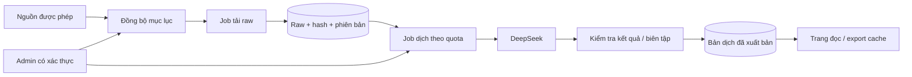

# Review Truyện Dịch Việt — 27/08/2026

**Production audit: 40/100 — chưa nên mở public.** Đây là đánh giá ưu tiên kỹ thuật, không phải điểm đo hiệu năng hay chứng nhận bảo mật. Các chặn triển khai chính: thiếu phân quyền, nguy cơ lộ secrets, model DeepSeek cũ và CI/CD chưa kiểm chứng được bản triển khai.

## 1. Phạm vi và bằng chứng

Đã đọc backend, models, crawler, worker dịch, batch manager, templates, exporter, Docker, workflow, tests và tài liệu. Đã đối chiếu tài liệu chính thức của DeepSeek và các nhà cung cấp hosting tại ngày review.

- Workspace không có `.git`: không kiểm tra được lịch sử secrets, commit, branch protection hoặc kết quả CI trên GitHub.
- Chạy kiểm tra trong thư mục tạm, chỉ sao chép `app/` và `tests/`; không sao chép `.env` hoặc database thật. Sử dụng khóa giả; các kiểm tra dịch gọi mock, không gọi DeepSeek.
- Lần đầu `python -m pytest -q tests/ --tb=short`: **2 failed, 3 passed**. Hai lỗi là `no such table: novels` ở homepage và admin.
- Chạy lại khi test cuối đã tạo schema: **5 passed, 3 warnings**. Kết quả này xác nhận test phụ thuộc trạng thái database, không chứng minh CI sạch.
- Runtime local là Python 3.14.6; Docker/CI khai báo Python 3.12. Chưa build/run Docker hoặc kiểm tra triển khai thật.
- Tái hiện bằng ASGI client và fixture tạm: anonymous `/admin` trả 200; anonymous gọi translate đi tới manager được mock; anonymous DELETE xóa thành công truyện fixture.
- Mock DeepSeek trả `finish_reason=length`: client vẫn nhận phần nội dung bị cắt mà không báo lỗi.
- Mock HTML Biquge: link tương đối và link bắt đầu bằng `/` đều bị nối sai khi catalog kết thúc bằng `index.html`.
- ASGI kiểm tra hai endpoint mà UI vote/download gọi: đều trả 404. Event SSE giả lập có `type=chapter_success` nhưng không có `event` mà UI đang chờ.
- Chưa đo coverage; chưa kiểm tra trình duyệt E2E, chất lượng dịch thật, nguồn crawl đang hoạt động, quyền sở hữu/tính khả dụng của domain hoặc tài khoản hosting.

## 2. Các phát hiện cần ưu tiên

### P0 — Không có ranh giới quyền giữa admin và khách

**Bằng chứng:** `app/main.py:180`, `:345`, `:401`, `:511`, `:574`, `:587`, `:601`. Các route không có dependency xác thực/quyền. `app/models.py` không có User, Session hoặc Role.

Khách có thể mở admin, thêm/xóa truyện, đổi glossary, bật/tắt sync và khởi động dịch bằng ngân sách của chủ hệ thống. Chỉ ẩn link `/admin` hoặc bảo vệ riêng trang HTML sẽ không chặn các API quản trị nằm dưới `/api/novels/*` và `/api/auto-updater/*`.

**Sửa:** gom toàn bộ thao tác quản trị vào router có `require_admin`; session cookie HttpOnly/Secure, CSRF cho thao tác ghi, đăng xuất/thu hồi session, rate limit, audit log. Nếu dùng identity ở reverse proxy, phải bảo vệ mọi route quản trị và chặn truy cập trực tiếp origin; không tin header identity do client tự gửi.

### P1 — Secrets có thể lọt vào image và gói upload

**Bằng chứng:** `Dockerfile:24` dùng `COPY . .`; `.dockerignore` chỉ loại `.env.local`, không loại `.env`. Workspace có `.env`. `docs/DEPLOYMENT.md:43` chứa chuỗi dạng API key, không được chép lại trong báo cáo. `.github/workflows/ci-cd.yml` upload toàn thư mục nhưng không loại `.env`, database chính hoặc `.db-shm`.

Chưa xác nhận chuỗi trong tài liệu là khóa thật hoặc đã từng được public. Nếu là khóa thật đã được chia sẻ, cần chủ tài khoản thu hồi/đổi khóa; không chỉ xóa khỏi tài liệu. Nếu đã build image với `.env`, cần xem image đó như vật chứa secret.

**Sửa:** thêm `.gitignore`, loại `.env*` trừ file mẫu khỏi nguồn publish; loại secrets và toàn bộ `data/` khỏi image/upload; ưu tiên COPY theo allowlist. CI chỉ dùng khóa giả. Secret production được inject lúc chạy. Kiểm tra các artifact đã từng phát hành nếu có.

### P1 — Model DeepSeek mặc định đã qua ngày ngừng hỗ trợ

**Bằng chứng:** `app/config.py:14`, `docker-compose.yml:13` dùng `deepseek-chat`. Compose còn gán cứng model, nên chỉ đổi `.env` có thể không đổi cấu hình container.

DeepSeek thông báo `deepseek-chat` và `deepseek-reasoner` không còn truy cập được sau 24/07/2026 15:59 UTC. Đây là đối chiếu tài liệu, chưa phải lỗi API được chạy trực tiếp trong review. Nguồn: [thông báo chính thức DeepSeek](https://api-docs.deepseek.com/news/news260424/).

**Sửa:** cập nhật cấu hình sang model còn hỗ trợ, ví dụ đánh giá `deepseek-v4-flash` cho dịch thường; khai báo rõ thinking mode và giới hạn output. Không chỉ đổi tên model rồi giả định chất lượng/chi phí giữ nguyên. Có contract test bằng response fixture và một smoke test trả phí nhỏ sau khi được chủ tài khoản cho phép.

### P1 — Crawl nhận URL không đáng tin cậy, có đường dẫn SSRF

**Bằng chứng:** `app/main.py:403`, `app/crawler/__init__.py`, `app/crawler/biquge.py:13`. Chọn adapter bằng substring, URL không khớp vẫn fallback Biquge; client cho phép redirect.

Kiểm tra offline xác nhận `get_crawler('http://127.0.0.1/private')` vẫn nhận adapter. Không truy cập mạng nội bộ thật. Với endpoint public hiện tại, server có thể bị yêu cầu truy cập host nội bộ hoặc mục tiêu ngoài danh sách nguồn.

**Sửa:** parse URL; allowlist hostname nguồn; chỉ HTTPS theo nhu cầu; chặn userinfo, IP private/loopback/link-local và port không hợp lệ; kiểm tra lại từng redirect và địa chỉ DNS đích; giới hạn kích thước response, timeout và egress. Không dựa vào việc URL có chứa tên nguồn.

### P1 — JavaScript được dựng từ dữ liệu truyện chưa escape đúng ngữ cảnh

**Bằng chứng:** `app/templates/novel_detail.html:86`, `:94` nhúng tên truyện/ảnh/tác giả vào chuỗi JavaScript trong `onclick`. Jinja HTML escaping không đủ cho JavaScript nằm trong attribute: dấu nháy được browser giải mã trở lại.

Một tiêu đề có dấu nháy có thể làm hỏng thao tác; dữ liệu độc hại có thể biến thành script khi người dùng bấm nút. Dữ liệu đến từ nguồn crawl hoặc `title_vi` nhập vào. Có thêm các sink `innerHTML` cần rà soát theo luồng dữ liệu, không coi mọi `innerHTML` là lỗi như nhau.

**Sửa:** bỏ inline handler động; dùng `data-*` được escape và `addEventListener`; đưa JSON vào ngữ cảnh an toàn; dùng `textContent` cho text. Escape nội dung trước khi dựng XHTML EPUB. Bổ sung CSP sau khi loại inline script phù hợp.

### P1 — “Đồng bộ raw” hiện mới là đồng bộ mục lục; định danh chương không ổn định

**Bằng chứng:** `app/main.py:442`, `app/crawler/auto_updater.py:82`, `:138`, `app/models.py:46`. Sync chỉ ghi title, URL, index, status. `content_raw` chỉ được lấy lúc dịch hoặc download; worker chỉ lưu raw sau khi dịch thành công (`app/translator/worker.py:166`, `:183`).

Đếm chương đã nhập không đồng nghĩa nội dung đã được lưu. Khi nguồn mất/chặn, các chương mới có thể không đọc/export được. Sync so sánh theo số thứ tự; nếu nguồn chèn/sắp lại chương, dữ liệu có thể bỏ sót hoặc gắn sai. Index `(novel_id, chapter_index)` không phải unique constraint; sync thủ công và định kỳ chạy chồng có thể tạo trùng.

**Sửa:** tách catalog sync và raw fetch; lưu raw ngay sau fetch thành công; định danh bằng source chapter ID/canonical URL; unique constraint + upsert + khóa theo truyện. Có `raw_hash`, `last_synced_at`, revision và phát hiện nguồn chỉnh sửa, không tự đè bản dịch đã biên tập.

### P1 — Batch không thực thi giới hạn chương và round-robin như mô tả

**Bằng chứng:** `app/translator/batch_manager.py:94` chỉ giảm con số hiển thị; `:132` gọi dịch mà không truyền danh sách hoặc giới hạn chương. `_process_queue` duyệt mỗi truyện một lần và để worker xử lý tất cả chương chưa hoàn thành.

Chọn N chương mỗi truyện vẫn có thể dịch cả bộ, tăng chi phí ngoài dự kiến. Pause chỉ ngăn chuyển sang truyện kế tiếp, không dừng nhận chương mới trong truyện đang chạy. Batch đánh dấu hoàn thành sau khi task kết thúc, không phản ánh đầy đủ chương lỗi.

**Sửa:** truyền tập chapter ID đã claim, thực hiện từng lượt N chương, đưa truyện còn việc về cuối queue; định nghĩa rõ pause/drain/cancel. Cập nhật số thành công/thất bại từ kết quả worker, không từ việc task biến mất.

### P1 — Client dịch không kiểm tra tính hoàn chỉnh của output

**Bằng chứng:** `app/translator/deepseek.py:58` chỉ lấy `message.content`; `app/translator/worker.py:185` lưu `completed`. Mock `finish_reason=length` đã được chấp nhận.

Không kiểm tra nội dung rỗng, bị cắt, từ chối, thiếu đoạn hay kết quả sai ngôn ngữ. Chunk theo 3.500 ký tự không tách được một đoạn đơn quá dài; chunk sau không có phần ngữ cảnh trước. Glossary chỉ là chỉ dẫn trong prompt, không đảm bảo model tuân thủ.

**Sửa:** kiểm tra response schema, `finish_reason`, output không rỗng, độ bao phủ đoạn và glossary; lưu trạng thái `needs_review` khi không đạt. Lưu token usage, request/model/prompt/glossary version; checkpoint theo chunk để tránh dịch lại các phần đã hoàn thành. Retry có phân loại lỗi; không retry mù 400/401/402; dùng backoff có jitter cho lỗi tạm thời. Tham khảo [schema Chat Completions](https://api-docs.deepseek.com/api/create-chat-completion/).

### P1 — Workflow “deploy HF” chưa triển khai ứng dụng chạy được

**Bằng chứng:** `.github/workflows/ci-cd.yml:100` dùng `repo_type='model'`, không phải `space`; README không có cấu hình Docker Space. Docker chạy cổng 8000 cố định.

Upload vào model repository chỉ đồng bộ file, không triển khai web app. Nếu chọn Spaces phải cấu hình Space đúng SDK/cổng, secrets và storage. Job “Docker Build & Healthcheck” hiện chỉ build, không chạy container để healthcheck. DuckDNS ping không phụ thuộc deploy và nuốt lỗi bằng `|| echo`, nên không chứng minh release khỏe.

### P1 — Request không giới hạn concurrency và không có trần tổng

**Bằng chứng:** `app/main.py:49`, `app/translator/worker.py:135`. Concurrency là số nguyên tự do và được dùng trực tiếp trong `Semaphore`: 0 làm các chương chờ vô hạn, số quá lớn mở nhiều request. Semaphore nằm trong từng job truyện, không giới hạn tổng số request của nhiều truyện chạy đồng thời.

**Sửa:** Pydantic bounds cho concurrency/range/count, enum cho policy; trần concurrency toàn worker và theo nguồn/provider, quota token/chi phí. Không coi `MAX_CONCURRENT_TRANSLATIONS` mặc định là trần cứng.

### P2 — Nút yêu cầu dịch, tải file và cập nhật SSE lệch hợp đồng backend

**Bằng chứng:** `app/templates/index.html:355`, `:390`, `app/templates/novel_detail.html:347`, `:376` gọi `/api/novels/{id}/request` và `/api/export/{id}/{format}`. Backend thực tế là `/api/novels/{id}/request-translation` và `/api/novels/{id}/download` hoặc `/novel/{id}/export/{format}`.

Hai thao tác UI này đi tới route không tồn tại. Ở admin, `admin_novel_translate.html:281` chờ `data.event === 'chapter_completed'`/`'finished'`, nhưng `worker.py:27`, `:208`, `:239` gửi trường `type` với `'chapter_success'`/`'complete'`. Log tổng quát vẫn có thể hiện, nhưng dòng chương/nút kết thúc không được cập nhật đúng.

**Sửa:** thống nhất route và event schema; thêm contract test và E2E từ nút bấm đến kết quả tải/vote/SSE, không chỉ kiểm tra HTML có status 200.

Ngoài ra `auto_translate` trong request sync chưa được áp dụng; `/translate-errors` chưa lọc riêng chương lỗi. Cần triển khai đúng hoặc sửa nhãn/tài liệu để không hứa chức năng chưa có.

### P2 — Tests, migration và runtime chưa đủ cho vận hành

**Bằng chứng:** `tests/test_api.py:7`, `:50`; `app/database.py:27`; `app/main.py:27`; `app/translator/worker.py:15`.

Test không override DB; HTTPX transport không tự chạy lifespan; test cuối mới gọi `init_db`. Chưa có kiểm thử auth, parser, batch, retry, export và E2E. Requirements chỉ có lower bound, không có lockfile; test dependency nằm chung runtime.

`create_all` không thay thế migration: database cũ không tự thêm cột mới. Scheduler, config và queue nằm trong RAM; deploy/restart mất trạng thái. Một số chương có thể còn `translating` sau cancel; có thể dịch lại thủ công vì query chọn mọi status chưa completed, nhưng không có tự phục hồi job. Không tăng số Uvicorn worker trước khi tách scheduler và claim công việc bền vững.

### P2 — Biquge dựng sai URL; export dễ chậm và gây hiểu nhầm

**Bằng chứng:** `app/crawler/biquge.py:75`, `:82`, `app/main.py:639`, `app/exporters/epub_txt.py:35`.

Mock catalog `https://source.example/book/42/index.html` với link `/book/42/1.html` tạo URL sai chứa `index.html/book/42/1.html`. Cần `urljoin` và kiểm tra hostname sau resolve.

Download là GET nhưng có thể crawl nhiều chương, ghi DB, rồi tạo file đồng bộ trong request. Không giới hạn dải, không cache/TTL, nuốt lỗi crawl. Export tiếng Việt fallback sang raw nên file gắn nhãn tiếng Việt có thể chứa chương Trung hoặc thiếu nội dung. Tên file không có novel ID nên hai truyện cùng tên/range có thể đè file.

**Sửa:** job export + cache theo ID/version/range/lang, đường dẫn duy nhất và ghi atomic; giới hạn dung lượng/dải; không crawl trong GET download. Công khai số chương thiếu và yêu cầu người dùng chọn rõ “chỉ bản dịch” hoặc “cho phép raw”.

## 3. Identity admin và độc giả

“Identity” nên xử lý cả danh tính/quyền và nhận diện giao diện.

| Vai trò | Nên được làm | Không được làm |
| --- | --- | --- |
| Khách | Đọc bản đã xuất bản; tải trong quota | Crawl, dịch trực tiếp, sửa glossary, xem log quản trị |
| Thành viên | Lưu tủ truyện, tiến độ đọc, bình luận, gửi yêu cầu dịch | Tiêu ngân sách API hoặc tự nâng quyền |
| Biên tập viên, nếu cần | Sửa bản dịch/glossary, duyệt chương | Quản lý secret, role hoặc ngân sách toàn hệ thống |
| Admin | Quản trị nguồn, job, người dùng, quota, xuất bản | Không cần hiện giá trị khóa API trên UI |

MVP có thể chỉ gồm khách và admin; không bắt người đọc đăng nhập để đọc. Khi thêm thành viên, dùng cùng một identity store với role phía server, không cần hai hệ thống tài khoản độc lập. Favorites/reading progress gắn user ID, có unique constraint. Tên bình luận tự khai không phải danh tính được xác minh.

`favorite_count`, vote dịch và like hiện tăng qua từng request không có ràng buộc người dùng. Vì batch ưu tiên vote, người gửi nhiều request có thể điều hướng ngân sách dịch. Cần idempotency, quota theo tài khoản/IP và chống spam; localStorage chỉ là tiện ích UI, không phải cơ chế chống lạm dụng.

Về giao diện, code đã có layout admin riêng và badge ADMIN: nên giữ. Trang độc giả tập trung đọc, tìm kiếm, đọc tiếp, tủ truyện; admin tập trung job, lỗi, số token và chi phí. Không đưa nút tiêu API trực tiếp vào reader. Dùng chung logo/tên Truyện Dịch Việt nhưng khác navigation; hiển thị tài khoản/role, đăng xuất và môi trường ở admin. Nhận xét này dựa trên template, chưa phải đánh giá hiển thị browser.

## 4. Stack hiện tại có hợp lý không?

**Có cho MVP, không cần viết lại bằng React/Next.js hoặc microservices.** Vấn đề lớn nằm ở quyền, dữ liệu và vòng đời job.

| Thành phần | Đánh giá và hướng đi |
| --- | --- |
| FastAPI + Pydantic | Giữ; tách routers public/admin, schema có bounds/enum, service layer |
| Jinja2 + JavaScript | Giữ; phù hợp nội dung đọc và render server; giảm inline JS, tránh tải toàn bộ nội dung chương khi chỉ cần mục lục |
| Tailwind + DaisyUI | Giữ; build CSS cố định thay CDN runtime, giảm font/assets. Play CDN không dành cho production theo [Tailwind](https://tailwindcss.com/docs/installation/play-cdn) |
| SQLAlchemy async | Giữ; thêm migrations, constraints và transaction rõ ràng |
| SQLite WAL | Hợp lý với một host có disk bền vững, tải nhỏ. Không đặt DB đang hoạt động trên filesystem tạm hoặc object storage |
| PostgreSQL | Chuyển khi web/worker nằm ở nhiều host, cần managed DB hoặc tăng concurrent writes. Không phải điều kiện bắt buộc cho ngày đầu |
| asyncio worker trong web | Chỉ phù hợp thử nghiệm. Bước tiếp: một worker riêng và bảng jobs bền vững; chưa cần Redis/Celery nếu queue SQL đủ dùng |
| HTTPX + BeautifulSoup | Phù hợp nguồn HTML tĩnh; adapter theo hostname + parser fixture + rate limit theo nguồn |
| Docker Compose | Giữ cho VM/máy sẵn có; chạy non-root, secrets runtime, volume bền vững, readiness và backup |

Chuyển SQLite sang Postgres không chỉ đổi URL: hiện `DATABASE_URL` bị gán cứng, có `PRAGMA` và `check_same_thread` đặc thù SQLite. Cần driver async phù hợp, migration và kiểm thử transaction trên DB đích.

## 5. Thiết kế kéo–đồng bộ–dịch đề xuất



Không cần tạo nhiều dịch vụ ngay: đây là ranh giới xử lý trong một codebase. Khuyến nghị ban đầu một web process và một worker process, dùng chung DB có claim/lease và khóa phù hợp.

Job nên có `status`, `attempts`, `max_attempts`, `next_run_at`, `lease_until`, `last_error`, `started_by`, `estimated_cost`, `actual_usage`. Chống dịch trùng bằng khóa gồm chapter/raw hash/model/prompt version/glossary version. Khi retry network timeout, vẫn có khả năng provider đã tính tiền; không hứa exactly-once chi phí API.

Tách trạng thái raw, dịch và xuất bản. Có raw thành công không đồng nghĩa dịch hoàn tất; dịch hoàn tất không nhất thiết đã duyệt xuất bản. Chỉ nhập và xuất bản nội dung có quyền sử dụng; lưu nguồn/tác giả và quy trình tiếp nhận yêu cầu gỡ.

## 6. DeepSeek và ngân sách

Hosting miễn phí không đồng nghĩa dịch AI miễn phí. DeepSeek API tính theo token; cần quota/ngày, quota/truyện và nút ngắt toàn bộ trước khi mở public.

Ví dụ minh họa, không phải số đo của dự án: 1.000 chương, mỗi chương 4.000 input + 4.000 output token, V4 Flash không cache, chưa tính retry/thinking, vào khoảng **3,52 USD ngoài giờ cao điểm hoặc 7,04 USD giờ cao điểm** theo bảng giá kiểm tra ngày review. Input phải gồm cả prompt/glossary. Giá có thể đổi: [DeepSeek Models & Pricing](https://api-docs.deepseek.com/quick_start/pricing/).

Đánh giá chất lượng trên tập chương đại diện trước khi chọn model: đủ nội dung, tên riêng/xưng hô, không lẫn ngôn ngữ, không lặp đoạn, không tự thêm tình tiết. Dùng glossary có version và ưu tiên thuật ngữ riêng của truyện; cho phép sửa tay, lưu lịch sử và dịch lại từng chunk. Không thể kết luận chất lượng bản dịch chỉ từ system prompt.

## 7. Deploy miễn phí và tên miền

Các tên dưới đây chỉ là gợi ý đặt tên, chưa kiểm tra khả dụng hoặc đăng ký. Domain riêng `.com`/`.vn` cần mua/gia hạn; subdomain miễn phí không phải quyền sở hữu domain riêng.

### A. Giữ hệ thống đầy đủ: máy sẵn có + Docker Compose

Đây là lựa chọn ít thay đổi nhất nếu có máy luôn bật. Giữ SQLite trên disk local, sao lưu ngoài máy; chạy worker riêng; HTTPS qua reverse proxy hoặc named Cloudflare Tunnel. Không mất phí thuê VM nhưng vẫn tốn điện, mạng và API; uptime phụ thuộc máy/đường truyền.

- Chưa có domain: có thể chọn `truyendichviet.duckdns.org` nếu còn trống. DuckDNS là DNS động miễn phí, không cung cấp hosting hay tự vượt CGNAT. Truy cập trực tiếp cần IP public/port forwarding và HTTPS. [DuckDNS FAQ](https://www.duckdns.org/faqs.jsp).
- Đã có domain riêng: named Cloudflare Tunnel tránh cần mở cổng inbound. Cần domain trong Cloudflare và máy chạy `cloudflared`; Tunnel có lựa chọn miễn phí. [Cloudflare Tunnel setup](https://developers.cloudflare.com/tunnel/setup/), [Free Tunnels](https://blog.cloudflare.com/tunnel-for-everyone/).
- Không dùng Quick Tunnel làm production: hostname ngẫu nhiên và không hỗ trợ SSE, ảnh hưởng console dịch. [Quick Tunnels](https://developers.cloudflare.com/cloudflare-one/networks/connectors/cloudflare-tunnel/do-more-with-tunnels/trycloudflare/).

### B. Không có máy luôn bật: Oracle Always Free, có điều kiện

Gần với kiến trúc Compose hiện tại nhất. Tài liệu tại ngày review ghi A1 miễn phí tương đương **2 OCPU/12 GB RAM**, tổng boot/block storage **200 GB** trong home region. Không mặc định dùng số 4 OCPU/24 GB từ hướng dẫn cũ. Có thể thiếu capacity và VM nhàn rỗi có thể bị thu hồi; cần backup và kiểm tra tài khoản/region/quota thực tế. [Oracle Always Free Resources](https://docs.oracle.com/en-us/iaas/Content/FreeTier/freetier_topic-Always_Free_Resources.htm).

Nếu chọn A1, build/test image ARM64. Domain có thể dùng DuckDNS hoặc domain đã mua. Không cam kết cấp được VM hoặc uptime như gói trả phí.

### C. Render Free + Neon: phù hợp thử nghiệm, phải sửa kiến trúc

Render Free ngủ sau 15 phút không có request; local SQLite mất khi restart/deploy/sleep và không gắn persistent disk miễn phí. Không chạy scheduler 24/7 trong web process. Free Render Postgres chỉ tồn tại 30 ngày. [Render Free](https://render.com/docs/free).

Dùng Postgres bên ngoài, ví dụ Neon Free hiện công bố 0,5 GB/project và 100 CU-hour/project/tháng; nội dung raw + dịch sẽ chiếm dung lượng nhanh. Cần worker riêng; export tạm hoặc object storage phù hợp. [Neon pricing](https://neon.com/pricing).

Có thể dùng tên kiểu `truyendichviet.onrender.com` nếu được cấp, hoặc custom domain đã sở hữu. Không phải deploy nguyên code rồi hoạt động bền vững miễn phí.

### D. Chỉ cần cổng đọc miễn phí: xuất bản website tĩnh

Giữ admin/crawl/dịch tại máy riêng, xuất HTML/JSON của chương đã duyệt lên static hosting. Có thể dùng tên kiểu `truyendichviet.pages.dev`; cần kiểm tra giới hạn số file/build/size. Cloudflare hiện khuyên dự án mới cân nhắc Workers, còn Pages vẫn có tài liệu triển khai static. [Pages setup](https://developers.cloudflare.com/pages/get-started/), [Pages limits](https://developers.cloudflare.com/pages/platform/limits/).

Đây là phương án đổi phạm vi sản phẩm: không giữ nguyên tài khoản/bình luận/queue realtime nếu chưa thêm backend. Hợp lý nếu ưu tiên trang đọc hoạt động khi máy dịch tắt.

### Không chọn Hugging Face làm phương án 0 đồng mặc định

Tài liệu hiện ghi tạo Docker/Gradio Space mới yêu cầu paid plan, dù CPU Basic không thu phí theo giờ; disk mặc định không persistent, free hardware có sleep. Custom domain thuộc PRO/Team/Enterprise. Vì vậy không khuyến nghị làm nơi chạy nguyên hệ thống này miễn phí. [Spaces overview](https://huggingface.co/docs/hub/spaces-overview), [Custom domain](https://huggingface.co/docs/hub/spaces-custom-domain).

**Lựa chọn đề xuất:** có máy luôn bật → A; muốn cloud giữ đầy đủ tính năng và chấp nhận rủi ro free tier → thử B; chỉ cần trang đọc ổn định, chi phí thấp → D. C phù hợp demo hơn pipeline đồng bộ/dịch liên tục.

## 8. CI/CD nên thiết kế lại thế nào?

```text
Pull request
  → cài dependencies từ lock
  → lint + unit/integration trên DB sạch + coverage
  → test quyền guest/member/admin; mock crawler/DeepSeek
  → build CSS + build image
  → chạy container với DB tạm + readiness + E2E tối thiểu

Main sau khi merge
  → build/publish image cùng commit SHA/digest
  → backup + migration có kiểm soát
  → deploy đúng artifact đã kiểm tra
  → kiểm tra HTTPS, readiness, đọc truyện và worker heartbeat
  → thất bại: rollback image; xử lý schema theo runbook
```

Không đưa secret production vào job test PR. Khóa permissions của Actions; pin dependencies/actions theo chính sách; serialize deploy; dùng environment approval nếu cần. Scanner lỗ hổng chỉ chạy trong CI đã được đội dự án chấp thuận; review này không upload code cho scanner ngoài.

Readiness nên kiểm tra DB/schema mà không query toàn bộ thư viện như trang chủ. Liveness riêng, worker heartbeat riêng. Backup SQLite bằng backup API/`.backup`, không copy đơn lẻ file DB đang WAL; có retention, bản sao ngoài host và diễn tập restore. Rollback image không tự rollback dữ liệu/migration.

## 9. Thứ tự thực hiện

1. **Chặn rủi ro public:** auth toàn bộ admin/API; quota; secrets/image; SSRF/XSS; đổi model DeepSeek.
2. **Sửa dữ liệu và tiền API:** unique/upsert, raw fetch riêng, batch đúng giới hạn, output validation, usage/cost, export rõ phần thiếu.
3. **Ổn định vận hành:** durable jobs, migration, test DB sạch, CSS build, lock dependencies, container non-root, backup/restore.
4. **Deploy thử ở một đích:** HTTPS/domain, smoke test thật có giới hạn, reboot/redeploy và kiểm tra mất job/dữ liệu; sau đó mới mở public.

Điều kiện tối thiểu để mở public: anonymous không gọi được thao tác quản trị; không có secret trong artifact; test không phụ thuộc data thật; batch không vượt quota; lỗi dịch không thành `completed`; dữ liệu tồn tại sau restart; restore thành công; model/API đã qua smoke test được cho phép.
