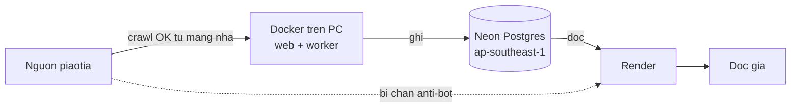

# Review Truyện Dịch Việt — 28/08/2026

Đợt review thứ hai, đối chiếu với [PROJECT_REVIEW_2026-08-27.md](PROJECT_REVIEW_2026-08-27.md) (40/100, "chưa nên mở public").

**Kết luận: gần như toàn bộ P0/P1 của đợt trước đã được sửa, và tôi đã kiểm chứng bằng cách chạy thật.** Khác với đợt trước — chỉ đọc code, không có `.git`, không build Docker — đợt này hệ thống đã được build, chạy hai container, nối vào Neon Postgres và nạp một bộ truyện thật từ nguồn.

## 1. Phạm vi và bằng chứng

Khác biệt quan trọng so với đợt trước: mọi khẳng định dưới đây đều có bước chạy tương ứng, không phải suy luận từ code.

- `pytest`: **144 passed** (136 sẵn có + 8 test tôi thêm). Test không còn phụ thuộc trạng thái database như đợt trước.
- `docker compose build` + `up -d`: web và worker đều đạt trạng thái `healthy`.
- Neon Postgres `truyen-dich-viet` (`ap-southeast-1`, PG 18.6): `init_db()` chạy migration thành công, cả web lẫn worker đều trỏ vào đây.
- Crawl thật một bộ truyện từ piaotia: nhập 517 chương mục lục, sau đó sync nạp 25 chương nguyên tác, **0 lỗi**.
- Ranh giới quyền kiểm chứng bằng HTTP: `/admin` ẩn danh trả 303 về login; `POST /api/novels/crawl` ẩn danh trả 401. Đăng nhập admin xong trả 200.
- Trang chủ, trang truyện, trang đọc, API mục lục: đều 200.
- Chưa kiểm: chất lượng bản dịch thật (chưa gọi DeepSeek trả phí), E2E trình duyệt, hành vi dài hạn của scheduler, khôi phục từ backup.

## 2. Ba lỗi phát hiện trong đợt này (đã sửa)

### P0 — Không thể nối Neon: `channel_binding` lọt xuống asyncpg

`app/config.py`. `normalize_database_url` dịch `sslmode=` sang `ssl=` bằng `str.replace`, nhưng để nguyên mọi tham số libpq khác. Connection string mặc định Neon phát ra có `channel_binding=require`, và SQLAlchemy chuyển thẳng query param thành keyword argument cho `asyncpg.connect()`:

```
TypeError: connect() got an unexpected keyword argument 'channel_binding'
```

Nghĩa là dán nguyên chuỗi Neon vào `DATABASE_URL` thì ứng dụng chết ngay lúc khởi động. Đây chính là thao tác mà tài liệu Neon hướng dẫn, nên lỗi này chặn đúng việc mà đợt review trước khuyến nghị (mục 4: "Chuyển SQLite sang Postgres không chỉ đổi URL").

**Đã sửa:** parse URL đúng cách, ánh xạ `sslmode` sang `ssl` theo bảng tra, giữ lại các keyword asyncpg thực sự hiểu (`ssl`, `target_session_attrs`, `krbsrvname`, `gsslib`) và loại bỏ phần còn lại. Mode lạ thì mặc định `require` để không âm thầm tắt TLS. Thêm 8 test hồi quy tại `tests/test_config.py`.

### P1 — `docker-compose.yml` chưa từng chạy được: YAML tách ở dấu phẩy

`docker-compose.yml:14`. `tmpfs: [/tmp:size=64m,mode=1777]` không được bọc nháy, nên YAML parse thành **hai** phần tử:

```
['/tmp:size=64m', 'mode=1777']
```

Docker từ chối với `invalid mount path: 'mode=1777' mount path must be absolute`. Cả hai service dùng chung anchor `x-app` nên web lẫn worker đều không khởi động được.

Điều này xác nhận nhận định của đợt trước rằng bản triển khai chưa được kiểm chứng. Đáng lưu ý: CI `container-smoke` dùng `docker run` trực tiếp chứ không dùng compose file, nên nó vẫn xanh trong khi compose hỏng.

**Đã sửa:** bọc nháy giá trị. **Gợi ý:** cho CI chạy `docker compose config` (hoặc dựng stack bằng chính compose file) để lỗi loại này không lọt.

### P2 — `.env.example` trỏ model đã ngừng hỗ trợ

`.env.example` vẫn ghi `DEEPSEEK_MODEL=deepseek-chat`, trong khi `app/config.py`, `render.yaml` và `docker-compose.yml` đều đã chuyển sang `deepseek-v4-flash`. Người cài mới copy file mẫu sẽ dùng model đã bị gỡ. **Đã sửa.**

## 3. Đối chiếu với báo cáo 27/08 — đã khắc phục

Đã kiểm chứng từng mục, không phải chỉ đọc lướt:

| Phát hiện cũ | Trạng thái | Bằng chứng |
| --- | --- | --- |
| P0 Không có ranh giới quyền | **Đã sửa** | `APIRouter(dependencies=[Depends(require_admin)])`; PBKDF2 600k vòng; session lưu DB có `credential_version`; CSRF cho thao tác ghi; rate limit; `AuditLog`. Kiểm chứng bằng 401/303 khi ẩn danh |
| P1 Secrets lọt vào image | **Đã sửa** | `.dockerignore` chuyển sang allowlist; CI assert `not os.path.exists('/app/.env')` và `os.getuid() != 0` |
| P1 Model DeepSeek cũ | **Đã sửa** | `deepseek-v4-flash` ở config/compose/render (trừ `.env.example`, xem trên) |
| P1 SSRF | **Đã sửa** | `crawler/security.py`: chỉ HTTPS, allowlist hostname, chặn IP literal và dải private, ghim DNS, tự kiểm từng redirect, chặn body quá cỡ, rate limit 1 req/s |
| P1 XSS trong JavaScript | **Đã sửa** | `innerHTML` chỉ còn template tĩnh; dữ liệu truyện đi qua `textContent`, `replaceChildren`, `ui.safeImageURL` |
| P1 Định danh chương không ổn định | **Đã sửa** | `UniqueConstraint(novel_id, chapter_index)` và `(novel_id, url)`; upsert `on_conflict_do_nothing`; `raw_hash`, `raw_fetched_at`, `source_changed`; migration chặn deploy khi có trùng |
| P1 Batch không thực thi giới hạn | **Đã sửa** | `batch_manager.py` dùng `.limit(chapters_per_novel)` thật; round-robin bằng `zip_longest` thật |
| P1 Không kiểm tra output dịch | **Đã sửa** | `parse_completion` kiểm schema; chặn `finish_reason != "stop"`; `quality_issues()` soát chữ Trung sót, độ dài bất thường, thiếu đoạn, thiếu thuật ngữ; kết quả nghi vấn lưu `needs_review` |
| P1 Workflow deploy HF không chạy được app | **Đã sửa** | Job HF đã bỏ. CI có `container-smoke` chạy thật web và worker, kiểm readiness, kiểm `/admin != 200`, restart worker để kiểm phục hồi lease |
| P1 Không giới hạn concurrency | **Đã sửa** | `validate_concurrency` chặn trong khoảng 1 đến `MAX_CONCURRENT_TRANSLATIONS`; `DailyTokenBudget` đặt chỗ token trước mỗi request; vượt hạn mức thì job chuyển `paused` |
| P2 UI gọi route không tồn tại | **Đã sửa** | Toàn bộ `fetch()` trong template khớp route backend; SSE thống nhất qua `emit_event` có cả `type` lẫn alias `event` |
| P2 Tests, migration, runtime | **Đã sửa phần lớn** | 144 test, cổng coverage 80%, `requirements.txt` pin hash, `pip_audit` trong CI; job bền vững trong DB (`translation_jobs`, `translation_tasks`, `translation_checkpoints`), lease singleton, `recover_interrupted_work` khi khởi động |
| P2 Biquge dựng sai URL | **Đã sửa** | `same_source_url()` dùng `urljoin` rồi kiểm lại hostname |
| P2 Export chậm, gây hiểu nhầm | **Đã sửa phần lớn** | Có `MAX_EXPORT_CHAPTERS`, `EXPORT_TTL_HOURS`, chặn payload quá lớn. Xem tồn đọng số 3 |

Kiến trúc đề xuất ở mục 5 báo cáo cũ (tách catalog sync, raw fetch và job dịch; lease; claim bền vững) đã được hiện thực gần đúng như mô tả.

## 4. Tồn đọng — theo thứ tự nên xử lý

### 1. Trạng thái auto-updater là biến trong RAM của từng process

`app/routes/admin.py:47,127,219` đọc `auto_updater.last_sync_stats`, `.sync_logs`, `.last_sync_time` từ singleton **trong process web**. Nhưng với docker compose (hoặc Oracle), vòng sync định kỳ chạy trong **process worker**.

Kiểm chứng: sau khi worker chạy 8 phút và đang giữ lease, `/api/auto-updater/status` vẫn trả `"last_sync_time": null` và `"last_log": "Chưa chạy lần nào"`.

Hệ quả: bảng điều khiển admin không phản ánh việc sync đang thật sự diễn ra. Quản trị viên sẽ tưởng sync chết và bấm sync thủ công, đẩy tải crawl lên process web — đúng thứ mà kiến trúc worker riêng muốn tránh.

**Sửa:** đưa `last_sync_time`, `last_sync_stats` và `sync_logs` xuống database (đã có sẵn `SystemSetting` và pattern `dialect_insert`), rồi cho route đọc từ đó. Đây cũng là điều kiện để chạy nhiều web process sau này.

### 2. Nạp raw quá chậm, và refetch vô hạn khi đã đủ

`auto_updater._fetch_raw` giới hạn `CRAWLER_MAX_RAW_PER_SYNC` (mặc định 25) mỗi lượt, chu kỳ mặc định 30 phút.

- Bộ truyện vừa nạp có 517 chương, tức khoảng **10 giờ** mới có đủ nguyên tác. Trong khoảng đó, chương chưa nạp không đọc/export/dịch được nếu nguồn chặn.
- `raw_candidates` sắp xếp `raw_fetched_at ASC NULLS FIRST` nhưng **không loại chương đã có raw**. Khi đã nạp đủ, mỗi lượt vẫn refetch 25 chương cũ nhất, mãi mãi — với thư viện N truyện là 25×N request mỗi 30 phút, không có điểm dừng.

**Sửa:** tách hai chế độ. "Nạp lần đầu" chạy hết phần thiếu với hạn mức cao hơn; "làm mới" chỉ đụng vào chương đủ cũ (ví dụ `raw_fetched_at` quá 7 ngày) hoặc chỉ các chương cuối bộ — nơi nguồn thực sự hay sửa. Đưa `CRAWLER_MAX_RAW_PER_SYNC` vào cấu hình admin thay vì chỉ để ở biến môi trường.

### 3. Không export nổi bộ truyện dài hơn `MAX_EXPORT_CHAPTERS`

Truyện vừa nạp có 517 chương, `MAX_EXPORT_CHAPTERS` mặc định 500. Gọi export trả 422 kèm "Mỗi lần tải tối đa 500 chương." Người dùng không có cách nào tải trọn bộ, và thông báo không gợi ý phải làm gì tiếp.

**Sửa:** khi vượt hạn mức, tự chia thành nhiều tệp theo dải, hoặc trả lỗi kèm danh sách dải hợp lệ để UI dựng sẵn nút chọn.

### 4. CSP không giới hạn script

`app/main.py` đặt `base-uri`, `object-src`, `frame-ancestors`, `form-action` — nhưng **không có `default-src` hay `script-src`**. Vì template vẫn chứa khối `<script>` inline lớn, bổ sung `script-src` sẽ làm hỏng giao diện nếu làm ẩu.

Việc dữ liệu truyện đã được xử lý bằng `textContent` (mục 3) khiến rủi ro hiện tại thấp, nhưng CSP là lớp phòng thủ thứ hai đang thiếu.

**Sửa:** chuyển JS inline sang tệp trong `/static`, rồi thêm `default-src 'self'; script-src 'self'`. Làm sau các mục trên.

### 5. Rate limiter chỉ đúng khi có một process web

`app/auth.py` `RateLimiter` lưu trong RAM, chú thích đã nói rõ "Deployment uses one web process". `Dockerfile` cố định `--workers 1`, nên hiện tại nhất quán. Nhưng đây là ràng buộc ẩn: tăng worker uvicorn sẽ âm thầm nhân hạn mức lên. Cân nhắc chuyển sang bảng đếm trong DB khi cần scale, hoặc ghi ràng buộc này vào `docs/DEPLOYMENT.md`.

### 6. Dung lượng Neon cần theo dõi

Đo thực tế trên dữ liệu vừa nạp: **6.826 byte mỗi chương** nguyên tác (tiếng Trung, UTF-8 3 byte một ký tự). Cộng bản dịch tiếng Việt, ước tính khoảng **12–15 KB mỗi chương**.

Một bộ 500 chương rơi vào khoảng **6–8 MB**. Với gói Neon Free thường được công bố 0,5 GB mỗi project, đó là khoảng **60–80 bộ truyện** — nên xác nhận lại hạn mức hiện hành trên bảng giá Neon trước khi lên kế hoạch thư viện lớn. Hiện database đang dùng 8,89 MB.

Khi tới hạn, phương án rẻ nhất là đẩy `content_raw` của chương đã dịch xong sang object storage hoặc xóa hẳn — đã có `raw_hash` để phát hiện nguồn đổi mà không cần giữ toàn văn.

### 7. `DATABASE_SYNC_URL` không dùng được với Postgres

`app/config.py:77` dựng `DATABASE_SYNC_URL` bằng cách thay tiền tố driver, nên với Postgres chuỗi kết quả vẫn mang `ssl=require` — tham số psycopg2 không hiểu (nó cần `sslmode`). Hiện chỉ `tests/conftest.py` dùng biến này và nó ghi đè bằng SQLite, nên chưa gây lỗi. Nên xóa hoặc sửa cho đúng trước khi có ai dựa vào nó.

## 5. Kiến trúc đồng bộ qua Neon

Neon mở ra đúng cách vá cho vấn đề Cloudflare chặn IP của Render (commit `0c3661e`, `SourceChallenged`). Kiểm chứng trong đợt này: máy ở nhà crawl piaotia **0 lỗi**, trong khi Render bị chặn.



Phân vai đề xuất:

- **PC (docker compose)** giữ vai trò nạp và dịch: có `APIKEY_DEEPSEEK`, đặt `RUN_EMBEDDED_WORKER=0`, worker riêng giữ lease.
- **Render** chỉ phục vụ nội dung đã nạp. Vì lease là singleton trong DB, khi PC đang bật thì worker nhúng của Render tự đứng im — cơ chế này đã có sẵn trong `embedded_worker.py`.

Lưu ý khi vận hành: nếu để Render giữ `RUN_EMBEDDED_WORKER=1`, khi PC tắt Render sẽ giành lease và lại gặp chặn Cloudflare. Cân nhắc đặt `RUN_EMBEDDED_WORKER=0` trên Render và chấp nhận việc sync chỉ chạy khi PC bật — đổi lại là không có job lỗi rác.

## 6. Thứ tự đề xuất

1. Đưa trạng thái auto-updater xuống DB (tồn đọng 1) — nếu không, mọi quan sát vận hành đều sai.
2. Sửa chiến lược nạp và refetch raw (2) — ảnh hưởng trực tiếp tới thời gian có đủ truyện và lượng request tới nguồn.
3. Cho CI kiểm `docker compose config` — chặn lớp lỗi vừa gặp.
4. Sửa export theo dải (3).
5. Chốt vai trò Render và PC, ghi vào `docs/DEPLOYMENT.md` kèm hướng dẫn Neon.
6. Gỡ JS inline rồi siết CSP (4).
7. Theo dõi dung lượng Neon (6); chuẩn bị phương án hạ tải `content_raw`.
